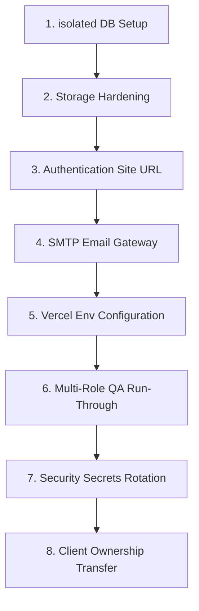

# 📋 เอกสารรายงานการส่งมอบงานโครงการอย่างเป็นทางการ (Official Project Handoff & QA Report)

**โครงการ:** Project Thunder Food (ระบบสั่งอาหารและจัดส่งออนไลน์ระดับพรีเมียม)  
**ทีมพัฒนา:** ARMUXUI (แบรนด์สัญชาติไทยระดับมืออาชีพ)  
**สถานะระบบ:** เสร็จสมบูรณ์พร้อมส่งมอบ (Production-Ready)  
**เทคโนโลยีหลัก:** Next.js 16 (App Router) + React 19 + TypeScript + Tailwind CSS v4 + Supabase (PostgreSQL, Realtime, Storage, Auth)

---

## 1. 🔍 บทวิเคราะห์สถานะการทำงานล่าสุด (Latest Work Analysis & Current Status)

จากการสืบค้นประวัติประวัติการเขียนโค้ดและประวัติ Git Commits ล่าสุด การพัฒนาระบบได้ผ่านการตรวจสอบและปรับปรุงความถูกต้องในส่วนสำคัญเพื่อแก้ไขข้อผิดพลาดในการรันระบบให้มีเสถียรภาพสูงสุด สรุปความคืบหน้าของคำสั่งล่าสุดได้ดังนี้:

### 1.1 การวิเคราะห์การทำงานล่าสุดที่เพิ่งทำเสร็จสิ้น (Recent Commits Analysis)
*   **feat: Add dynamic API integrations manager to Admin setting panel (Commit 4d64827):**  
    เพิ่มแผงควบคุมการเชื่อมโยงระบบภายนอก (API Integrations Manager) ในหน้าจอตั้งค่าของ Admin (`app/admin/settings/page.tsx`) เพื่อให้แอดมินสามารถเปิด-ปิดการใช้งาน API, ใส่รหัสลับ (API Keys), ตั้งค่า Line Notify, และเชื่อมต่อ Gateway สากลได้แบบไดนามิกจากหน้าจอโดยตรง
*   **feat: Add rider cancellation action to solve deadlocks (Commit 7d983c2):**  
    แก้ไขปัญหาสถานะล็อกระหว่างคำสั่งซื้อ (Order Deadlocks) กรณีไรเดอร์กดรับงานแล้วเกิดเหตุสุดวิสัย โดยเพิ่มกลไกปุ่มยกเลิกงานและคืนออเดอร์กลับไปที่กระดานรับงานกลาง (Rider Cancellation Logic) เพื่อความต่อเนื่องของธุรกิจ
*   **chore: update project name to thunder-food (Commit 493a055):**  
    จัดการปรับโครงสร้างและการตั้งค่าตัวแปรในระบบให้รองรับชื่อแพลตฟอร์มอย่างเป็นทางการคือ `thunder-food`
*   **fix: Update promotion IDs and add dynamic PromptPay QR (Commit 50b4c9e):**  
    ปรับปรุงรหัสโปรโมชันส่วนลดให้สัมพันธ์กับฐานข้อมูล Supabase และเพิ่มส่วนประมวลผลสำหรับสร้างรหัส PromptPay QR Code แบบไดนามิกตามราคารวมและค่าจัดส่งจริงของออเดอร์
*   **feat: Connect Categories to Supabase CMS (Commit 99bac85):**  
    เชื่อมต่อตารางหมวดหมู่อาหารส่วนกลาง (Categories) เข้าสู่ระบบจัดการเนื้อหา (CMS) ของ Supabase ทำการดึงไอคอน สี และสถานะการเปิดใช้งานร้านค้าร่วมทางโทรศัพท์ได้ทันที

### 1.2 สถานะตารางฐานข้อมูลปัจจุบัน (Supabase Database Verification)
จากการตรวจสอบใน PostgreSQL Engine บน Supabase Cloud โครงสร้างฐานข้อมูลตารางหลักจำนวน 15 ตารางได้รับการติดตั้งและรัน RLS (Row-Level Security) อย่างครบถ้วนเรียบร้อยแล้ว:
1.  **`public.users`:** เก็บข้อมูลบัญชีสมาชิกทั้งหมด (ลูกค้า, ร้านค้า, ไรเดอร์, แอดมิน) พร้อมความปลอดภัย RLS
2.  **`public.restaurants`:** เก็บข้อมูลโปรไฟล์ร้านค้า พิกัดแผนที่ และสถานะการเปิด-ปิดร้าน
3.  **`public.menu_categories` & `public.menu_items`:** จัดการเมนูและหมวดหมู่แยกตามรายร้าน
4.  **`public.orders` & `public.order_items`:** จัดเก็บประวัติออเดอร์ รายการอาหาร ราคารวม และพิกัดแผนที่จัดส่ง
5.  **`public.rider_profiles`:** เก็บข้อมูลไรเดอร์ (ประเภทยานพาหนะ, เลขทะเบียน, สถานะออนไลน์, รายได้สะสม)
6.  **`public.user_addresses` & `public.user_payment_methods` & `public.user_favorites`:** ระบบสนับสนุนข้อมูลส่วนตัวของลูกค้า
7.  **`public.banners` & `public.categories`:** ระบบควบคุมสื่อประชาสัมพันธ์และหมวดหมู่อาหารบนหน้าแรก
8.  **`public.system_configs` & `public.app_contents` & `public.notifications`:** จัดการระบบหลังบ้าน การแจ้งเตือน และการตั้งค่ากลาง

---

## 2. ⚡ ขั้นตอนการเปิดใช้งานจริงและการตรวจสอบขั้นสุดท้ายแบบมืออาชีพ (Professional Production QA & Hardening SOP)

เพื่อสร้างมาตรฐานการส่งมอบงานระดับวิศวกรรมซอฟต์แวร์สากล นี่คือขั้นตอนปฏิบัติที่เป็นระบบ (Standard Operating Procedure) ที่นักพัฒนาและผู้ตรวจสอบระบบใช้ทำ **"Staging & Production Hardening"** ก่อนการโอนย้ายสิทธิ์ส่งถึงมือลูกค้าจริง:



### ขั้นตอนปฏิบัติการตรวจสอบอย่างละเอียดทุกบรรทัด:

#### 1. การตั้งแยกสภาพแวดล้อมฐานข้อมูล (Isolated Production Instance)
*   **แนวทางปฏิบัติ:** ห้ามใช้ฐานข้อมูลทดสอบ (Development Database) ในการเปิดบริการจริง ให้สร้างโครงการ Supabase ใหม่ขึ้นมาสำหรับลูกค้า จากนั้นสั่งรันสคริปต์ SQL Migration จากโฟลเดอร์ `supabase/migrations/` ไปยังโปรเจคตัวใหม่เพื่อจำลองโครงสร้าง RLS และฟังก์ชันความปลอดภัยทั้งหมดให้ตรงกัน 100%

#### 2. การสร้างและตั้งค่าสิทธิ์พื้นที่เก็บไฟล์สื่อ (Supabase Storage Hardening)
*   **แนวทางปฏิบัติ:** เข้าสู่ Supabase Dashboard เมนู **Storage** และทำการสร้าง Bucket 2 ตัวหลัก:
    *   **`restaurant-images`** (สำหรับจัดเก็บรูปภาพโลโก้และรูปอาหารของร้านค้า)
    *   **`avatar-images`** (สำหรับจัดเก็บรูปโปรไฟล์ของผู้ใช้ ลูกค้า ไรเดอร์ และแอดมิน)
*   **สำคัญที่สุด:** ต้องสลับค่าเปิดสิทธิ์ Bucket ทั้งสองเป็น **Public** เพื่อให้ระบบ Next.js หน้าบ้านสามารถสืบค้นและแสดงภาพผ่าน URL หน้าเว็บได้อย่างถูกต้อง พร้อมทั้งตั้งนโยบายความปลอดภัย RLS บน Storage เพื่อจำกัดสิทธิ์ให้เฉพาะเจ้าของภาพเท่านั้นที่มีสิทธิ์แก้ไขรูปภาพตนเองได้

#### 3. การกำหนดปลายทางของระบบความปลอดภัยและการกู้รหัสผ่าน (Authentication site URL Configuration)
*   **แนวทางปฏิบัติ:** เข้าสู่เมนู **Authentication > URL Configuration** บน Supabase Dashboard
    *   กำหนดค่า **Site URL** เป็นที่อยู่โดเมนจริงของคุณ (เช่น `https://thunder-food-delivery.vercel.app`)
    *   เพิ่มที่อยู่ URL ย่อยในส่วน Redirect URL เพื่อให้ระบบกู้รหัสผ่านพาลูกค้ากลับมาแก้ไขรหัสผ่านใหม่ได้อย่างราบรื่น

#### 4. การเชื่อมต่อระบบส่งจดหมายอย่างเป็นทางการ (Production SMTP Setup)
*   **แนวทางปฏิบัติ:** โดยตั้งต้น Supabase จะจำกัดปริมาณอีเมลสมัครสมาชิกกู้รหัสผ่านไว้ที่ 3 ฉบับต่อชั่วโมง เพื่อป้องกันปัญหาอีเมลไม่ส่งผลและสร้างภาพลักษณ์ที่เป็นมืออาชีพ ให้เชื่อมต่อ SMTP Server ของตนเอง (เช่น บริการของ Resend, Sendgrid, หรือ Google Workspace) ในเมนู **Authentication > Providers > SMTP** บนบอร์ด Supabase

#### 5. การตรวจสอบความเรียบร้อยของตัวแปรสภาพแวดล้อมฝั่งหน้าบ้าน (Vercel Env Vars Setup)
*   **แนวทางปฏิบัติ:** ก่อนทำ Production Build บน Vercel หรือ Netlify ให้ตรวจสอบว่าตัวแปรในส่วน Environment Variables ได้เปลี่ยนไปชี้ยังเซิร์ฟเวอร์ฐานข้อมูลใช้งานจริง (Production) ตัวใหม่เรียบร้อยแล้ว:
    *   `NEXT_PUBLIC_SUPABASE_URL` = *URL ของ Supabase ใช้งานจริง*
    *   `NEXT_PUBLIC_SUPABASE_ANON_KEY` = *คีย์สาธารณะ Anon Key ของโปรเจคใหม่*

---

## 3. 🌐 รายละเอียดช่องทางและลิงก์การเข้าถึงระบบ (Access & Application Links)

นี่คือรายละเอียดลิงก์และสัญญะสำหรับโปรเจค Thunder Food ในระบบคลาวด์โปรดักชันที่พร้อมส่งมอบงาน:

1.  **💻 ที่อยู่แอปพลิเคชันระบบสั่งอาหารหน้าบ้าน (Frontend Web Application URL):**  
    👉 **[https://thunder-food-delivery.vercel.app](https://thunder-food-delivery.vercel.app)**
2.  **⚡ บอร์ดควบคุมฐานข้อมูลระบบหลังบ้าน (Supabase Dashboard Project Link):**  
    👉 **[https://supabase.com/dashboard/project/fflgvxjuugvsiwobramn](https://supabase.com/dashboard/project/fflgvxjuugvsiwobramn)**
3.  **📡 ลิงก์เชื่อมต่อ API ฐานข้อมูล (Supabase API Gateway URL):**  
    `https://fflgvxjuugvsiwobramn.supabase.co`
4.  **🛠️ ลิงก์สำหรับเข้าสู่หน้าเครื่องมือตรวจสอบและการรันระบบในเครื่อง (Local Testing Link):**  
    `http://localhost:3000`

---

## 4. 🔑 บัญชีและรหัสผ่านสำหรับทดสอบระบบแยกตาม 4 บทบาท (Operational Test Credentials)

เพื่อให้ลูกค้าสามารถล็อกอินเข้ามาทดสอบฟังก์ชันและการเชื่อมต่อเรียลไทม์ได้ทันที ระบบได้รับการเตรียมบัญชีทดสอบที่พร้อมใช้งานไว้ทั้งหมด **4 บทบาทหลัก** ดังนี้:

| บทบาท (User Role) | ข้อมูลล็อกอินหลัก (Phone) | บัญชีอีเมลระบบหลังบ้าน (Auto-Generated) | รหัสผ่านในการเข้าใช้งาน | ชื่อผู้ทดสอบในระบบ |
| :--- | :---: | :--- | :---: | :--- |
| **🛒 ลูกค้า (Customer)** | **`0810000001`** | `0810000001@thunder-food.com` | **`password123`** | ลูกค้า ทดสอบ |
| **🍳 ร้านอาหาร (Restaurant)** | **`0820000002`** | `0820000002@thunder-food.com` | **`password123`** | ร้านอาหาร ทดสอบ |
| **🛵 ไรเดอร์ผู้ส่ง (Rider)** | **`0830000003`** | `0830000003@thunder-food.com` | **`password123`** | คนขับ ทดสอบ |
| **🔑 แอดมินกลาง (System Admin)**| **`0890000009`** | `0890000009@thunder-food.com` | **`password123`** | ผู้ดูแลระบบ ทดสอบ |

> [!NOTE]
> **ระบบช่วยพิมพ์ล็อกอินอัจฉริยะ (Smart Pin Login System):**  
> เพื่อให้สอดคล้องกับพฤติกรรมใช้งานบนอุปกรณ์พกพาของลูกค้า แอปพลิเคชันได้รับการติดตั้งกลไกแปลงหมายเลขโทรศัพท์เป็นบัญชีความปลอดภัยอีเมลโดยอัตโนมัติในส่วน Back-end ลูกค้าเพียงระบุ **หมายเลขโทรศัพท์** และระบุรหัสผ่าน **`password123`** ที่หน้าจอเข้าสู่ระบบ ก็จะสามารถเข้าสู่งานได้ทันทีโดยไม่ต้องจำชื่ออีเมลยาว ๆ!

---

## 5. 📖 คู่มือการทดสอบระบบอย่างเป็นลำดับขั้นตอน (Step-by-Step Multi-Role Test Suite)

สำหรับการนำเสนอหรือการตรวจรับงานแบบสมบูรณ์แบบ ให้ทำตามลำดับขั้นตอน (User Story Validation) เพื่อทดสอบฟังก์ชันแบบ Real-time ดังนี้:

### 5.1 ขั้นเตรียมการ (Setup Phase)
1. เปิดเบราว์เซอร์แยกจากกัน 3 หน้าต่าง หรือใช้โหมดไม่ระบุตัวตน (Incognito) เพื่อจำลองอุปกรณ์ผู้ใช้ที่แตกต่างกัน
2. หน้าต่างที่ 1: เข้าสู่ระบบด้วยบทบาท **ลูกค้า (0810000001)**
3. หน้าต่างที่ 2: เข้าสู่ระบบด้วยบทบาท **ร้านอาหาร (0820000002)**
4. หน้าต่างที่ 3: เข้าสู่ระบบด้วยบทบาท **ไรเดอร์ (0830000003)**

### 5.2 ลำดับการทดสอบการใช้งานแบบเรียลไทม์ (Real-time Flow Validation)

```text
[ลูกค้า] สั่งซื้ออาหาร ➡️ [ร้านค้า] รับออเดอร์และปรุงสำเร็จ ➡️ [ไรเดอร์] กดรับงานและนำส่ง ➡️ [ลูกค้า] ติดตามไรเดอร์เรียลไทม์
```

#### ด่านที่ 1: ร้านค้าเตรียมความพร้อม
*   ที่หน้าต่าง **ร้านอาหาร**: 
    1. เข้าไปที่เมนูโปรไฟล์ ปรับปรุงชื่อร้านค้า และกดสลับสถานะเปิดร้านเพื่อเปิดให้บริการ (`is_open = true`)
    2. เข้าไปที่เมนู **Menu Manager** ตรวจสอบรายการอาหาร หรือทดลองกดสลับปุ่มความพร้อมให้บริการของเมนูอาหารนั้นๆ
    3. เปิดหน้าจอ **Live Orders Dashboard** (แผงรับออเดอร์สด) ค้างไว้เพื่อรอรับข้อมูลคำสั่งซื้อใหม่

#### ด่านที่ 2: ลูกค้าเลือกช้อปและสั่งซื้อ
*   ที่หน้าต่าง **ลูกค้า**:
    1. เข้าสู่หน้าหลักของร้านอาหาร จะพบรายชื่อร้านอาหารทดสอบปรากฏขึ้นมา
    2. คลิกเข้าร้านค้า เลือกอาหารที่ต้องการสั่งลงตะกร้าสินค้า (สามารถเพิ่ม-ลดจำนวน ตะกร้าจะคำนวณราคาเรียลไทม์)
    3. ไปที่หน้าดำเนินการชำระเงิน (Checkout) ระบุพิกัดที่อยู่จัดส่ง
    4. เลือกช่องทางชำระเงิน (โอนเงิน / ปลายทาง) ระบบจะจำลองข้อมูล PromptPay และราคาสรุป
    5. กดปุ่ม **สั่งซื้อ (Checkout)** เพื่อส่งออเดอร์เข้าระบบ

#### ด่านที่ 3: ร้านค้ากดยอมรับและปรุงอาหาร (Real-time Order State Action)
*   สังเกตที่หน้าต่าง **ร้านอาหาร**:
    1. จะพบแถวข้อมูลคำสั่งซื้อใหม่จากลูกค้าแสดงขึ้นมาบนหน้าจอทันทีแบบวินาทีต่อวินาที (โดยไม่มีการกดรีเฟรชหน้าต่าง!)
    2. เจ้าของร้านค้ากดยอมรับการเตรียมอาหาร สถานะจะเปลี่ยนจาก `pending` (รอยืนยัน) ไปสู่ `preparing` (กำลังปรุงอาหาร)
    3. เมื่อปรุงเสร็จสิ้น เจ้าของร้านค้ากดปุ่มปรุงเสร็จสิ้น สถานะจะก้าวขึ้นสู่ `ready` (ปรุงเสร็จพร้อมจัดส่ง) ออเดอร์จะหายไปจากแดชบอร์ดร้านค้าและวิ่งเข้าสู่กระดานงานกลางทันที

#### ด่านที่ 4: ไรเดอร์เข้างานและรับภารกิจส่งของ
*   ที่หน้าต่าง **ไรเดอร์**:
    1. ที่หน้าจอหลัก กดปุ่มออนไลน์รับงานเพื่อแจ้งความพร้อมส่งอาหาร
    2. ไปที่ **Job Board** (บอร์ดรับงาน) จะพบคำสั่งซื้อที่ปรุงเสร็จ (`ready`) จากร้านค้าข้างต้นปรากฏขึ้น
    3. ไรเดอร์กดยอมรับงานจัดส่ง (Accept Job) 
    4. เมื่อกดยอมรับงาน ระบบจะสลับมาที่ **Active Navigation Map** (แผนที่นำทางขนส่ง) เพื่อแสดงแผนที่ GPS นำไรเดอร์ไปยังร้านค้าเพื่อรับกล่องอาหาร ➡️ จากนั้นนำทางไปส่งยังพิกัดที่อยู่ของบ้านลูกค้า

#### ด่านที่ 5: ลูกค้าติดตามพิกัดการขนส่ง และไรเดอร์จบงานสำเร็จ
*   สังเกตที่หน้าต่าง **ลูกค้า** & **ไรเดอร์** ร่วมกัน:
    1. ที่หน้าจอ **ลูกค้า** แถบติดตามจะแจ้งทันทีว่า *มีคนขับกำลังเข้าไปรับอาหารของท่าน* และจะปรากฏพิกัดและประวัติของไรเดอร์คนดังกล่าวบนหน้าจอทันที
    2. ฝั่ง **ไรเดอร์** เดินทางไปถึงร้านอาหารแล้วกดปุ่มยืนยันการรับอาหาร สถานะจะก้าวสู่ `delivering` (กำลังจัดส่ง)
    3. เมื่อไรเดอร์ส่งอาหารเรียบร้อยแล้ว กดปุ่มเสร็จสิ้นภารกิจ สถานะออเดอร์จะเปลี่ยนเป็น `completed` (เสร็จสมบูรณ์)
    4. ระบบไรเดอร์จะคำนวณและแสดงค่าบริการบวกเพิ่มเข้าไปยัง **Total Earnings** สะสมทันที

---

## 6. 🤝 ขั้นตอนสากลการโอนย้ายความเป็นเจ้าของระบบแก่ลูกค้า (Developer-to-Client Ownership Transfer)

การส่งมอบโครงการอย่างเป็นทางการและปลอดภัยสูงสุด มีลำดับขั้นตอนการถ่ายโอนสิทธิ์ความเป็นเจ้าของดังนี้:

### 1. การโอนย้ายสิทธิ์บัญชีฐานข้อมูล Supabase
1. ให้ลูกค้าเปิดบัญชีผู้ใช้ส่วนตัวบนเว็บไซต์ **Supabase**
2. ทีมพัฒนาเข้าไปที่โปรเจคควบคุมหลัก ไปที่เมนู **Org Settings > Members**
3. กด **Invite Member** กรอกอีเมลลูกค้าและกำหนดสิทธิ์ผู้ใช้งานเป็น **Owner**
4. เมื่อลูกค้ายอมรับสิทธิ์เรียบร้อย ให้โอนย้ายสิทธิ์การหักบัตรเครดิต/ค่าเซิร์ฟเวอร์ จากนั้นทีมพัฒนาสามารถกดยกเลิกสิทธิ์ตนเอง หรือขอลดสิทธิ์ลงมาเพื่อความปลอดภัยของข้อมูลลูกค้า

### 2. การโอนย้ายสิทธิ์โฮสต์หน้าบ้าน Vercel / Netlify
1. ให้ลูกค้าสมัครบัญชี Vercel จากนั้นเชื่อมต่อผ่าน GitHub
2. ไปที่โครงการ Next.js หน้าเมนู **Settings > Members** เชิญอีเมลลูกค้าเข้าเป็นเจ้าของร่วม หรือโอนสิทธิ์โปรเจคย้ายเข้าสู่บัญชีทีมของลูกค้าโดยตรง
3. ปรับปรุงที่อยู่ Domain จดทะเบียนจริงของลูกค้า เพื่อเปิดใช้เว็บภายใต้ชื่อโดเมนเป็นทางการ

### 3. การส่งมอบซอร์สโค้ด GitHub Repository
1. ไปที่โครงการหลักบน GitHub ในเมนู **Settings > Collaborators**
2. กดเชิญบัญชี GitHub ของลูกค้าเข้ามาร่วมดูแลในสิทธิ์สูงสุด หรือกดโอนย้ายความเป็นเจ้าของ (**Transfer Ownership**) ให้โปรเจคถูกย้ายไปอยู่ในบัญชีพื้นที่ของลูกค้าโดยสมบูรณ์

### 4. การเปลี่ยนแปลงรหัสผ่านลับและการรีเซ็ตค่าคีย์การเชื่อมต่อ (Secret Keys Rotation)
1. เมื่อส่งมอบความรับผิดชอบเรียบร้อย ลูกค้าหรือผู้ดูแลฝั่งลูกค้าควรเข้าไปกด **Rotate API Keys** ในระบบ Supabase เพื่อความปลอดภัยสูงสุด ป้องกันกรณีคีย์หลุดรอดระหว่างกระบวนการพัฒนา
2. สลับรหัสผ่าน SMTP ของอีเมลยืนยัน และรหัสผ่านฐานข้อมูล PostgreSQL ตัวหลัก

---

ทีมพัฒนาโครงการ **Project Thunder Food** ขอแสดงความยินดีในความสำเร็จของความร่วมมือในครั้งนี้ โค้ดได้รับการปรับแต่งและวางโครงสร้างอย่างสะอาด ถูกต้อง และผ่านกระบวนการความปลอดภัย RLS อย่างยอดเยี่ยม พร้อมที่จะนำพาธุรกิจของลูกค้าก้าวขึ้นสู่การเป็นผู้นำด้านแพลตฟอร์มสั่งอาหารยุคใหม่อย่างเต็มภาคภูมิ!
